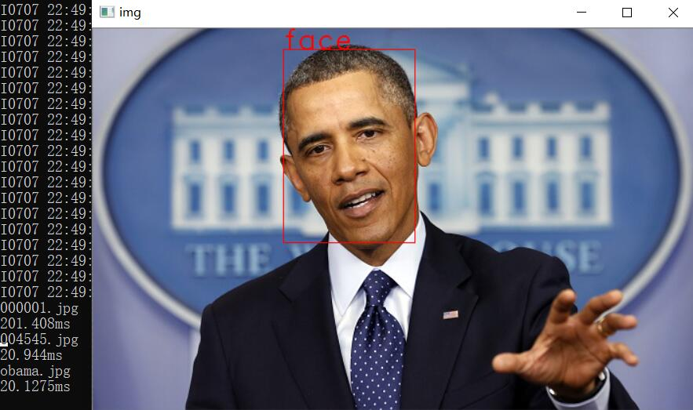

# ssd-face 使用MobileNet-SSD训练的人脸检测器

如果你正在使用opencv3.3及以上的版本，可以跳过第一节的caffe-ssd配置



### 1. 下载并编译[ssd](https://github.com/imistyrain/ssd) 
[原始版本](https://github.com/weiliu89/caffe)仅能在ubuntu下编译通过，这里提供一个可以在Windows、Linux和MAC都能编译的版本，并且添加了可分离卷积层的实现.

```
git clone https://github.com/imistyrain/ssd
mkdir build
cd build
make -j8
```

为方便起见，后文将下载的ssd所在文件夹记为$SSD_ROOT

### 2. 下载并编译本项目
本项目使用CMake进行跨平台编译并且需要OpenCV版本为3.3及以上,或者3.0以上自己编译带有dnn支持的库

```
git clone https://github.com/imistyrain/ssd-face
cd ssd-face
mkdir build
cd build
cmake ..
make -j4
```

### 3. 运行demo

下载预训练好的[模型](https://github.com/imistyrain/ssd-face/releases)（[MobileNetSSD_face.caffemodel](https://github.com/imistyrain/ssd-face/releases/download/1.0/MobileNetSSD_face.caffemodel), 120000 iters, 约21M），将其置于Face文件夹下.将[face_deploy.prototxt](https://github.com/imistyrain/ssd-face/releases/download/1.0/face_deploy.prototxt)和[SSD_Face_300x300_iter_120000.caffemodel](https://github.com/imistyrain/ssd-face/releases/download/1.0/SSD_Face_300x300_iter_120000.caffemodel)放于models文件夹下.

#### 3.1 python版本

```python
python demo.py
```

#### 3.2 Windows C++版本

如果你正在使用opencv3.3及以上版本，其自带了dnn支持,如果是3.2及以下版本，则需要外加opencv_extra重新编译opencv,(注意勾选WITH_DNN)

双击打开ssd-face.slnall将SSDFace设为启动项，编译完成后运行即可

###### Note:其中opencv跨平台自动化配置可参见[MRHead](https://github.com/imistyrain/MRHead)

### 4. 训练自己的数据

#### 4.1 准备训练数据，将数据转换为VOC格式

如果想直接训练fddb的话，可以直接下载已经转换好的[fddb库](http://pan.baidu.com/s/1pK8jglP)(百度网盘， 密码：g33x，约102M)，并将其置于/home/data/Face2017下，这个步骤过程可以参见[将fddb标注转换为VOC格式标注](http://blog.csdn.net/minstyrain/article/details/77938596)

当然，你也可以换成自己的数据，推荐一个好用的标注工具:[MRLabeler](https://github.com/imistyrain/MRLabeler)

#### 4.2 生成训练所需格式数据

```
python create_lmdb.py
```
原始ssd需要将数据放到指定目录并且要运行两个脚本，其对文件位置有这严苛的要求，稍有不慎就会弄错.本项目根据其中的内容提取成了create_list.py文件，其包含两个函数，create_list把训练图片路径及其标注按行写入到trainval.txt中，把测试图片路径及其标注按行写入到test.txt中，把测试图片路径及其大小（高度、宽度）写入到test_name_size.txt中

```
Note:由于fddb中含有多级目录,为了兼容SSD及YOLO的训练结构要求,此脚本将路径中的"/"转换为了"_"
```

create_data用于生成训练所需的lmdb文件,由于要支持多标签的输入，因此其内部使用了slice data layer，避免使用hdf5生成文件过大的问题

#### 4.3 启动训练

```
sh train.sh
```

## vgg_ssd

```
python ssd_train.py
python ssd_test.py
```
the trained model is about 90M.

## 参考

* [SSD目标检测](https://blog.csdn.net/minstyrain/article/details/87350554)

* [SSD原理解读-从入门到精通](https://blog.csdn.net/qianqing13579/article/details/82106664)

* [用SSD训练自己的数据集(VOC2007格式)](http://blog.csdn.net/zhy8623080/article/details/73188594)

* [将fddb标注转换为VOC格式标注](http://blog.csdn.net/minstyrain/article/details/77938596)

* [yolo-face](https://github.com/imistyrain/yolo-face)